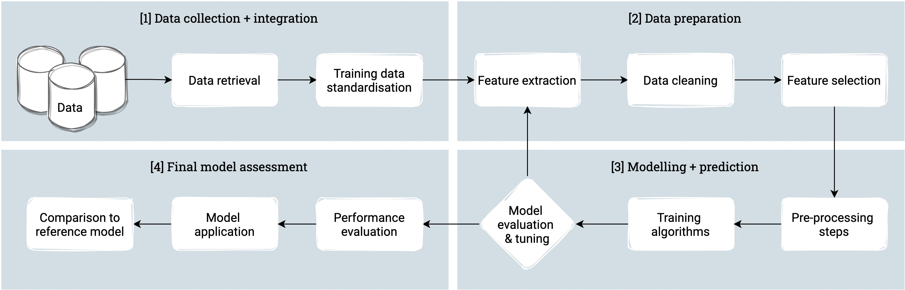

# Inference of building floor count in the Netherlands

This repository contains the code developed during the graduation project of Ellie Roy for the MSc in Geomatics at TU Delft. 
For further details, the thesis report is available [here](http://resolver.tudelft.nl/uuid:6de4255c-ab2b-49c2-a282-ed779de092a1). 

## Introduction 

Data on the number of floors is required for a variety of applications, ranging from energy demand estimation to flood response plans. 
Despite this, open data on the number of floors is currently not available at a nationwide level in the Netherlands.
This means that it must be inferred from other available data. 
Automatic methods usually involve dividing the estimated height of a building by an assumed storey height. 
In some cases, this simple approach limits the accuracy of the results. 
Therefore, the goal of this thesis was to develop an alternative method to automatically infer the number of floors. 

The alternative method was based on machine learning. 
Three different algorithms were tested and compared: Random Forest, Gradient Boosting and Support Vector Regression.
These algorithms were trained using data on the number of floors obtained from four municipalities in the Netherlands.
In addition, 25 features were derived from cadastral attributes, building geometry and neighbourhood census data.
These features were tested in different combinations in order to determine whether a specific subset yielded better results. 
Furthermore, a comparison was made between features derived from 3D building models at different levels of detail.

An overview of the methdology is provided by the flowchart below: 

   

## Dependencies 
The code was written in `Python (v3.9.7)`.
A `PostgreSQL (v10.19)` database extended with `PostGIS (v3.0.1)` was used to store the data used during the analysis. 
The implementation depends on the following Python libraries: 

* [geopandas v0.9.0](https://pypi.org/project/geopandas/0.9.0/)
* [pandas v1.3.1](https://pypi.org/project/pandas/1.3.1/)
* [numpy v1.21.2](https://pypi.org/project/numpy/1.21.2/)
* [psycopg2 v2.9.1](https://pypi.org/project/psycopg2/2.9.1/)
* [pyvista v0.31.3](https://pypi.org/project/pyvista/0.31.3/)
* [scipy v1.7.1](https://pypi.org/project/scipy/1.7.1/)
* [statsmodels v0.13.0](https://pypi.org/project/statsmodels/0.13.0/)
* [scikit-learn v0.24.2](https://pypi.org/project/scikit-learn/0.24.2/)
* [sklearn-pandas v2.2.0](https://pypi.org/project/sklearn-pandas/2.2.0/)
* [joblib v1.1.0](https://pypi.org/project/joblib/1.1.0/)
* [seaborn v0.11.1](https://pypi.org/project/seaborn/0.11.1/)
* [matplotlib v3.4.3](https://pypi.org/project/matplotlib/3.4.3/)
* [tqdm v4.62.0](https://pypi.org/project/tqdm/4.62.0/)
* [val3ditypy v0.2](https://github.com/tudelft3d/val3ditypy/releases/tag/0.2)

The conda environment used during this thesis can be recreated from the `environment.yml` file using the following command: `conda env create -f environment.yml`. However, the `val3ditypy` library must be installed separately (see installation details [here](https://github.com/tudelft3d/val3ditypy)). 

## Data

## Usage

### Data preparation 

* **Training data standardisation**: `get_train_data.py`
* **Data retrieval**: `retrieve_data.py`
* **Extract 2D features**: `extract_2d_features.py`
* **Extract 3D features**: `extract_3d_features.py`
* **Data cleaning**: `clean_data.py`
* **Extract reference model**: `get_ref_model.py`

All data preparation steps can be performed by running `main.py`. 

### Modelling and prediction 

* **Train models**: `train_models.py`
* **Select feature subsets**: `select_features.py`
* **Tune models**: `tune_models.py`
* **Evaluate models**: `test_models.py`

### Analysis 
* **Compute statistical measures**: `compute_stats.py`
* **Analysis of results**: `analyse_results.py`
* **Compare predictions to reference model**: `compare_to_ref.py`
* **Case study analysis**: `case_study.py`

## Parameters

The `params.json` file contains all parameters that can be set by the user. These parameters are defined as follows: 

* `models_to_train`: 
* `feature_selection_models`: 
* `tuned models`:
* `use_tuned_params`: 
* `best_estimator`:
* `features`: 
* `ml_algorithms`: 
* `best_estimator`: 
* `training_schema`: